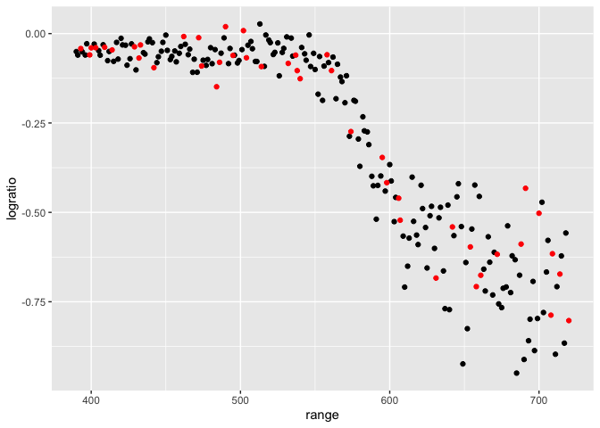
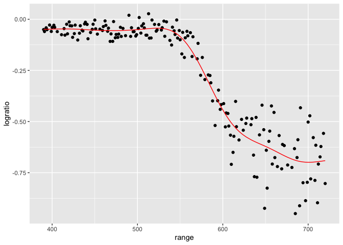
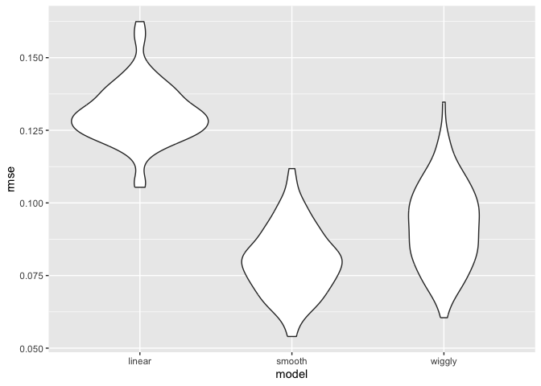
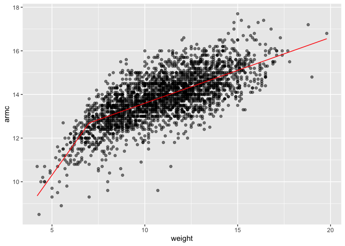
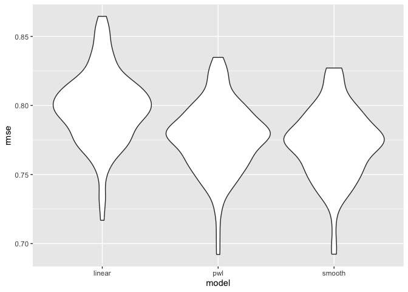

cross_validation
================
Kimia Faroughi
2025-11-11

Load packages

``` r
library(tidyverse)
```

    ## ── Attaching core tidyverse packages ──────────────────────── tidyverse 2.0.0 ──
    ## ✔ dplyr     1.1.4     ✔ readr     2.1.5
    ## ✔ forcats   1.0.0     ✔ stringr   1.5.1
    ## ✔ ggplot2   3.5.2     ✔ tibble    3.3.0
    ## ✔ lubridate 1.9.4     ✔ tidyr     1.3.1
    ## ✔ purrr     1.1.0     
    ## ── Conflicts ────────────────────────────────────────── tidyverse_conflicts() ──
    ## ✖ dplyr::filter() masks stats::filter()
    ## ✖ dplyr::lag()    masks stats::lag()
    ## ℹ Use the conflicted package (<http://conflicted.r-lib.org/>) to force all conflicts to become errors

``` r
library(p8105.datasets)
library(modelr)
```

Import data

``` r
data("lidar")
```

Look at the data

``` r
lidar
```

    ## # A tibble: 221 × 2
    ##    range logratio
    ##    <dbl>    <dbl>
    ##  1   390  -0.0504
    ##  2   391  -0.0601
    ##  3   393  -0.0419
    ##  4   394  -0.0510
    ##  5   396  -0.0599
    ##  6   397  -0.0284
    ##  7   399  -0.0596
    ##  8   400  -0.0399
    ##  9   402  -0.0294
    ## 10   403  -0.0395
    ## # ℹ 211 more rows

``` r
lidar_df = 
  lidar |> 
  mutate(id = row_number())

lidar_df |> 
  ggplot(aes(x = range, y = logratio)) +
  geom_point()
```

<!-- -->

## Create dataframes

``` r
train_df =
  sample_frac(lidar_df, size = .8) |> #80% of data
  arrange(id)

test_df = anti_join(lidar_df, train_df, by = "id") #rows in lidar_df that did not show up in train_df
```

Look at these

``` r
ggplot(train_df, aes(x = range, y = logratio)) +
  geom_point() +
  geom_point(data = test_df, color = "red")
```

<!-- -->

Fit a few modles to `train_df`

``` r
linear_mod = lm(logratio ~ range, data = train_df) #using linear_mod doesn't do as good as a job as smooth_mod
smooth_mod = mgcv::gam(logratio ~ s(range), data = train_df)
wiggly_mod = mgcv::gam(logratio ~ s(range, k = 30), sp = 10e-6, data = train_df) #don't do this
```

Look at this

``` r
train_df |> 
  add_predictions(smooth_mod) |> 
  ggplot(aes(x = range, y = logratio)) +
  geom_point() +
  geom_line(aes(y = pred), color = "red")
```

<!-- -->

Try computing our RMSEs

``` r
rmse(linear_mod, test_df)
```

    ## [1] 0.1228243

``` r
rmse(smooth_mod, test_df) #noticable difference in root mean square error
```

    ## [1] 0.07115581

``` r
rmse(wiggly_mod, test_df) #close to smooth fit
```

    ## [1] 0.08010315

## ITERATE !

``` r
cv_df =
  crossv_mc(lidar_df, n = 100) |> #proudces resample rather than df
  mutate(
    train = map(train, as_tibble),
    test = map(test, as_tibble) #convert to tibble
  )
```

Did this work?

``` r
cv_df |> pull(train) |> nth(1)
```

    ## # A tibble: 176 × 3
    ##    range logratio    id
    ##    <dbl>    <dbl> <int>
    ##  1   391  -0.0601     2
    ##  2   393  -0.0419     3
    ##  3   394  -0.0510     4
    ##  4   399  -0.0596     7
    ##  5   400  -0.0399     8
    ##  6   403  -0.0395    10
    ##  7   405  -0.0476    11
    ##  8   406  -0.0604    12
    ##  9   408  -0.0312    13
    ## 10   412  -0.0500    16
    ## # ℹ 166 more rows

Let’s fit models over and over

``` r
cv_df = cv_df |> 
  mutate(
    linear_fits = map(train, \(df) lm(logratio ~ range, data = df)), #anonymous function w one argument df
    smooth_fits = map(train, \(df) mgcv::gam(logratio ~ s(range), data = df)),
    wiggly_fits = map(train, \(df) mgcv::gam(logratio ~ s(range, k = 50), sp = 10e-8, data = df))
  ) |> 
  mutate(
    rmse_linear = map2_dbl(linear_fits, test, rmse),
    rmse_smooth = map2_dbl(smooth_fits, test, rmse),
    rmse_wiggly = map2_dbl(wiggly_fits, test, rmse)
  )
```

Let’s try to look at this better

``` r
cv_df |> 
  select(starts_with("rmse")) |> 
  pivot_longer(
    everything(),
    names_to = "model",
    values_to = "rmse",
    names_prefix = "rmse_"
  ) |> 
  ggplot(aes(x = model, y = rmse)) +
  geom_violin()
```

<!-- -->

## Nepalese children

``` r
growth_df =
  read_csv("nepalese_children.csv")
```

    ## Rows: 2705 Columns: 5
    ## ── Column specification ────────────────────────────────────────────────────────
    ## Delimiter: ","
    ## dbl (5): age, sex, weight, height, armc
    ## 
    ## ℹ Use `spec()` to retrieve the full column specification for this data.
    ## ℹ Specify the column types or set `show_col_types = FALSE` to quiet this message.

Weight v arm_c

``` r
growth_df |> 
  ggplot(aes(x = weight, y = armc)) +
  geom_point(alpha = .5)
```

<!-- -->

``` r
growth_df =
  growth_df |> 
  mutate(
    weight_cp7 = (weight > 7) * (weight - 7)
  )
```

Let’s fit 3 models

``` r
linear_mod = lm(armc ~ weight, data = growth_df)
pwl_mod = lm(armc ~ weight + weight_cp7, data = growth_df) #piecewise linear
smooth_mod = mgcv::gam(armc ~ s(weight), data = growth_df)
```

Plot piecewise linear fit

``` r
growth_df |> 
  add_predictions(pwl_mod) |> 
  ggplot(aes(x = weight, y = armc)) +
  geom_point(alpha = .5) +
  geom_line(aes(y = pred), color = "red")
```

<!-- -->

Now cross validate !

``` r
cv_df =
  crossv_mc(growth_df, n = 100) |> 
  mutate(
    train = map(train, as_tibble),
    test = map(test, as_tibble)
  )
```

``` r
cv_df =
  cv_df |> 
  mutate(
    linear_mod = map(train, \(df) lm(armc ~ weight, data = df)),
    pwl_mod = map(train, \(df) lm(armc ~ weight + weight_cp7, data = df)),
    smooth_mod = map(train, \(df) mgcv::gam(armc ~ s(weight), data = df))
  ) |> 
  mutate(
    rmse_linear = map2_dbl(linear_mod, test, rmse),
    rmse_pwl = map2_dbl(pwl_mod, test, rmse),
    rmse_smooth = map2_dbl(smooth_mod, test, rmse)
  )
```

Create my violin plots!!

``` r
cv_df |> 
  select(starts_with("rmse")) |> 
  pivot_longer(
    everything(),
    names_to = "model",
    values_to = "rmse",
    names_prefix = "rmse_"
  ) |> 
  ggplot(aes(x = model, y = rmse)) +
  geom_violin()
```

<!-- -->
